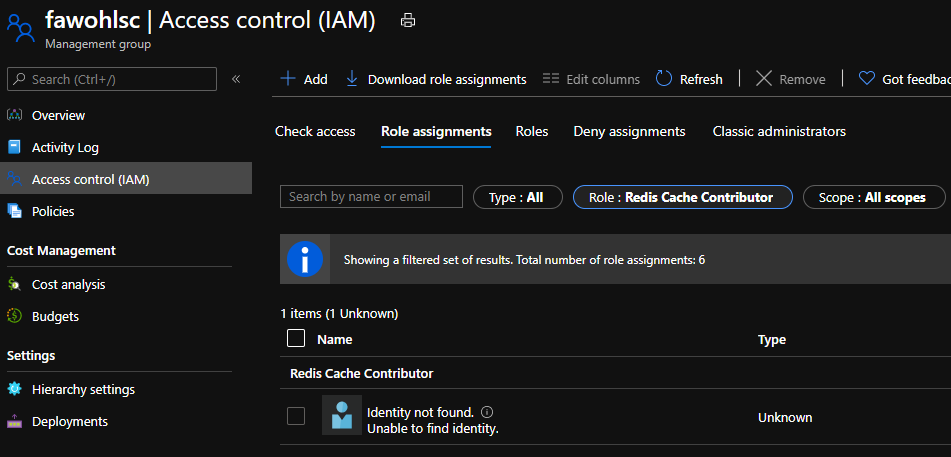

# Redis Firewall Rules

Deploys Redis firewall rules and denies creating incompliant firewall rules. The policies are wrapped in an [ARM template](azuredeploy.json) to ease deployment. Deploying the [ARM template](azuredeploy.json) to a management group of choice will result in the following:
- **Policy Definitions**
  - **Deny-Redis-FirewallRules**: Denies creating incompliant firewall rules.
  - **Deploy-Redis-FirewallRule**: Deploys a single Redis firewall rule.
- **Policy Set Definitions**
  - **Deploy-Redis-FirewallRules**: Groups multiple instances of **Deploy-Redis-FirewallRule** into a policy set to deploy multiple Redis firewall rules.
- **Policy Assignments**
  - **Deny-Redis-FirewallRules**: Assigns policy definition **Deny-Redis-FirewallRules** to the management group.
  - **Deploy-Redis-FirewallRules**: Assigns policy set definition **Deploy-Redis-FirewallRules** to the management group.
- **Role Assignments**
   - **Deploy-Redis-FirewallRules**: Role assignment for the managed identity created during policy assignment **Deploy-Redis-FirewallRules**.

## Try on Portal

[](https://portal.azure.com/#create/Microsoft.Template/uri/https%3A%2F%2Fraw.githubusercontent.com%2Ffawohlsc%2Fazure-policy-samples%2Fmain%2Fredis-firewallrules%2Fazuredeploy.json)
[](https://portal.azure.us/#create/Microsoft.Template/uri/https%3A%2F%2Fraw.githubusercontent.com%2Ffawohlsc%2Fazure-policy-samples%2Fmain%2Fredis-firewallrules%2Fazuredeploy.json)

> In case you face any errors during deployment, please see [Known Issues](#known-issues).

## Try with PowerShell

```powershell
$managementGroup = "fawohlsc"
$location = "northeurope"
$templateParameterObject = @{
    "managementGroup" = $managementGroup;
    "firewallRules"   = @(
        @{
            "name"    = "rule1";
            "startIP" = "10.0.0.0";
            "endIP"   = "10.1.0.0"
        },
        @{
            "name"    = "rule2";
            "startIP" = "20.0.0.0";
            "endIP"   = "20.2.0.0"
        }
    )
}

New-AzManagementGroupDeployment `
    -Location $location `
    -ManagementGroupId $managementGroup `
    -TemplateUri "https://raw.githubusercontent.com/fawohlsc/azure-policy-samples/main/redis-firewallrules/azuredeploy.json" `
    -TemplateParameterObject $templateParameterObject
```

> In case you face any errors during deployment, please see [Known Issues](#known-issues).

## Try with CLI

```sh
az deployment mg create --location "northeurope" --management-group-id "fawohlsc" --template-uri "https://raw.githubusercontent.com/fawohlsc/azure-policy-samples/main/redis-firewallrules/azuredeploy.json" --parameters \
"{ \
    'managementGroup': { \
        'value': 'fawohlsc' \
    }, \
    'firewallRules': { \
        'value': [ \
            { \
                'name': 'rule1', \
                'startIP': '10.0.0.0', \
                'endIP': '10.1.0.0' \
            }, \
            { \
                'name': 'rule2', \
                'startIP': '20.0.0.0', \
                'endIP': '20.2.0.0' \
            } \
        ] \
    }, \
}"
```

> In case you face any errors during deployment, please see [Known Issues](#known-issues).

## Known Issues
- **PrincipalNotFound** - For remediating resources, a managed identity is created during policy assignment **Deploy-Redis-FirewallRules**. In case Azure Active Directory did not complete the provisioning of the managed identity in time, the role assignment **Deploy-Redis-FirewallRules** will fail. Just rerun the deployment to resolve the issue.
- **RoleAssignmentUpdateNotPermitted** - When you delete the policy assignment for **Deploy-Redis-FirewallRules**, the  managed identity is deleted as well. Unfortunately, the deletion does not include the role assignment for the managed identity. Before redeploying the [ARM template](azuredeploy.json), You have to manually delete the role assignment marked with *Identity not found.* and role *Redis Cache Contributor* at the management group:

   

## Notes
[Firewall rules](https://docs.microsoft.com/en-us/azure/templates/microsoft.cache/redis/firewallrules) are not exposed as inline property within its parent resource [Redis](https://docs.microsoft.com/en-us/azure/templates/microsoft.cache/redis):

```json
// Redis - no property 'firewallRules'
{
  "name": "string",
  "type": "Microsoft.Cache/Redis",
  "apiVersion": "2019-07-01",
  "properties": {
    "redisConfiguration": {},
    "enableNonSslPort": "boolean",
    "replicasPerMaster": "integer",
    "tenantSettings": {},
    "shardCount": "integer",
    "minimumTlsVersion": "string",
    "sku": {
      "name": "string",
      "family": "string",
      "capacity": "integer"
    },
    "subnetId": "string",
    "staticIP": "string"
  },
  "zones": [
    "string"
  ],
  "location": "string",
  "tags": {},
  "resources": []
}

// Firewall Rules
{
  "name": "string",
  "type": "Microsoft.Cache/Redis/firewallRules",
  "apiVersion": "2019-07-01",
  "properties": {
    "startIP": "string",
    "endIP": "string"
  }
}
```

Hence, it is not possible to leverage the [array alias](https://docs.microsoft.com/en-us/azure/governance/policy/how-to/author-policies-for-arrays#referencing-array-fields) to easily iterate over the firewall rules within Azure Policy, e.g. ```Microsoft.Cache/Redis/firewallRules[*]```. Instead, the policy definition **Deploy-Redis-FirewallRule** had to be written to only deploy a single firewall rule:

```json
// Policy definition 'Deploy-Redis-FirewallRule'.
{
    "name": "Deploy-Redis-FirewallRule",
    "type": "Microsoft.Authorization/policyDefinitions",
    "apiVersion": "2020-03-01",
    "properties": {
        "policyType": "Custom",
        "mode": "All",
        "displayName": "Deploy-Redis-FirewallRule",
        "description": "Deploys Redis firewall rule.",
        "metadata": {
            "category": "Cache"
        },
        "parameters": {
            "firewallRule": {
                "type": "Object",
                "metadata": {
                    "displayName": "Firewall Rule",
                    "description": "The firewall rules to deploy."
                }
            }
        },
        "policyRule": {
            "if": {
                "field": "type",
                "equals": "Microsoft.Cache/Redis"
            },
            "then": {
                "effect": "deployIfNotExists",
                "details": {
                    "type": "Microsoft.Cache/Redis/firewallRules",
                    "roleDefinitionIds": [
                        "[variables('roleDefinitionId')]"
                    ],
                    // Does the firewall rule already exist?
                    "existenceCondition": {
                        "allOf": [
                            {
                                "field": "Microsoft.Cache/Redis/firewallRules/startIP",
                                "equals": "[[parameters('firewallRule').startIP]"
                            },
                            {
                                "field": "Microsoft.Cache/Redis/firewallRules/endIP",
                                "equals": "[[parameters('firewallRule').endIP]"
                            }
                        ]
                    },
                    "deployment": {
                        "properties": {
                            "mode": "incremental",
                            "parameters": {
                                "redisName": {
                                    "value": "[[field('name')]"
                                },
                                "firewallRule": {
                                    "value": "[[parameters('firewallRule')]"
                                }
                            },
                            "template": {
                                "$schema": "https://schema.management.azure.com/schemas/2019-04-01/deploymentTemplate.json#",
                                "contentVersion": "1.0.0.0",
                                "parameters": {
                                    "redisName": {
                                        "type": "string"
                                    },
                                    "firewallRule": {
                                        "type": "Object"
                                    }
                                },
                                "resources": [
                                    {
                                        // Child resources need to be prefixed with the name of the parent resource.
                                        "name": "[[concat(parameters('redisName'), '/', parameters('firewallRule').name)]",
                                        "type": "Microsoft.Cache/Redis/firewallRules",
                                        "apiVersion": "2019-07-01",
                                        "properties": {
                                            "startIP": "[[parameters('firewallRule').startIP]",
                                            "endIP": "[[parameters('firewallRule').endIP]"
                                        }
                                    }
                                ]
                            }
                        }
                    }
                }
            }
        }
    }
}
```

Usually, multiple firewall rules have to be deployed. While assigning the policy once per firewall rule is technically feasible, grouping and assigning them as policy set vastly improves manageability e.g., when reviewing compliance results.  In combination with [ARM copy](https://docs.microsoft.com/en-us/azure/azure-resource-manager/templates/copy-properties) the policy set can be dynamically composed based on the firewall rules which are passed as parameter to the [ARM template](azuredeploy.json):

```json
// Policy set definition 'Deploy-Redis-FirewallRules'
{
    "name": "Deploy-Redis-FirewallRules",
    "type": "Microsoft.Authorization/policySetDefinitions",
    "apiVersion": "2020-03-01",
    "properties": {
        "policyType": "Custom",
        "displayName": "Deploy-Redis-FirewallRules",
        "description": "Groups policies for deploying redis firewall rules.",
        "metadata": {
            "category": "Cache"
        },
        "parameters": {},
        // Adds a policy definition per firewall rule
        "copy": [
            {
                "name": "policyDefinitions",
                "count": "[length(parameters('firewallRules'))]",
                "input": {
                    "policyDefinitionId": "[extensionResourceId(variables('scope'), 'Microsoft.Authorization/policyDefinitions', 'Deploy-Redis-FirewallRule')]",
                    "parameters": {
                        "firewallRule": {
                            "value": "[parameters('firewallRules')[copyIndex('policyDefinitions')]]"
                        }
                    },
                    // Grouping policies eases reviewing compliance results.
                    "groupNames": [
                        "Deploy-Redis-FirewallRules"
                    ]
                }
            }
        ],
        "policyDefinitionGroups": [
            {
                "name": "Deploy-Redis-FirewallRules",
                "displayName": "Deploy-Redis-FirewallRules",
                "category": "Cache",
                "description": "Groups policies for deploying redis firewall rules."
            }
        ]
    },
    "dependsOn": [
        // Depends on policy definition 'Deploy-Redis-FirewallRule', which should be created beforehand.
        "[extensionResourceId(variables('scope'), 'Microsoft.Authorization/policyDefinitions', 'Deploy-Redis-FirewallRule')]"
    ]
}
```